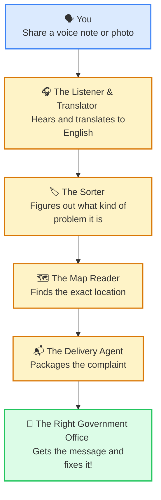

# JanSetu: The Magic Bridge for Your Neighborhood

> **One Problem. One Helper. The Right Solution.**

---

## 🛑 The Problem: The Confusing Castle

Imagine you are walking down the street and see a giant pothole, or a broken streetlight that makes the road too dark. You want to tell someone to fix it! 

But here is the tricky part: who do you tell? Do you call the mayor? The water department? The traffic police? Which website do you go to? What if you don't speak English and don't know how to write a formal letter? 

Right now, trying to fix a problem in your city feels like trying to deliver a letter in a giant castle with a thousand doors, and you don't have a map. It’s confusing, frustrating, and takes way too much time.

---

## 💡 The Concept: The Magic Mailbox

What if there was just **one magic mailbox** right in the middle of town? 

You wouldn't need to know who fixes roads or who fixes lights. You could just walk up to this mailbox, drop in a picture of the pothole, or even just *speak* to it in your own language ("Hey, there's a huge hole on Main Street!"). 

The magic mailbox would instantly understand you, translate your words, figure out exactly which room in the giant castle needs to hear about it, and deliver it straight to their desk. You do the talking; the mailbox does the walking.

---

## 🚀 The Idea: Meet JanSetu

**JanSetu** (which means "People's Bridge") is that magic mailbox for the real world! 

It is a simple, friendly platform on your phone. Instead of downloading 50 different government apps or figuring out complicated websites, you only need JanSetu. 

You just open it and share your problem using a text, a voice note, or a picture. JanSetu uses its built-in smarts to figure out where you are standing, what exactly is broken, and automatically sends your message to the exact government office that can fix it. 

---

##  What Makes JanSetu Unique?

There are other apps out there, but they usually make *you* do the hard work. They ask you to pick from long drop-down menus or know the official names of government departments. 

Here is why JanSetu is a completely different kind of bridge:
* **No Guessing Games:** You never have to guess who is in charge. You just report the problem, and JanSetu figures out the rest.
* **Speak Your Heart Out:** You don't need to type in perfect English. Speak in your local language, and JanSetu acts as your personal translator.
* **One Door for Everywhere:** Whether you are in Delhi, Maharashtra, or Karnataka, you don't need a new app. JanSetu knows how to talk to all the different government systems behind the scenes.

---

##  The "Smart Helper" Inside (AI Integrations & Agentic Use)

JanSetu works so well because it has a team of invisible, super-fast "helpers" (Artificial Intelligence) working together like a relay race. We call this an **Agentic Workflow**—meaning the system is smart enough to take charge and do the tasks for you from start to finish.

Here is how our smart helpers work together in the blink of an eye:

1. **The Listener (Speech-to-Text):** When you speak into your phone, a helper instantly turns your voice into written words, no matter what local language you are speaking.
2. **The Translator:** Another helper takes those words and carefully translates them into standard English so the government officials can read it clearly.
3. **The Sorter (AI Classifier):** A very smart helper reads your complaint. If you say "pipe is leaking," it instantly slaps a "Water Department" sticker on it. It also decides if it's an emergency.
4. **The Map Reader (GPS Geofencing):** This helper looks at where you are standing on the map and finds the exact local office responsible for that specific street.
5. **The Delivery Agent (Automated Routing):** Finally, our delivery helper packages your complaint neatly and drops it directly into the official government website (like CPGRAMS or Aaple Sarkar).

---

### How Your Problem Travels Across the Bridge:

> **The bottom line:** JanSetu doesn't just listen to your problems; it actively takes them by the hand and makes sure they get to the people who can fix them.
